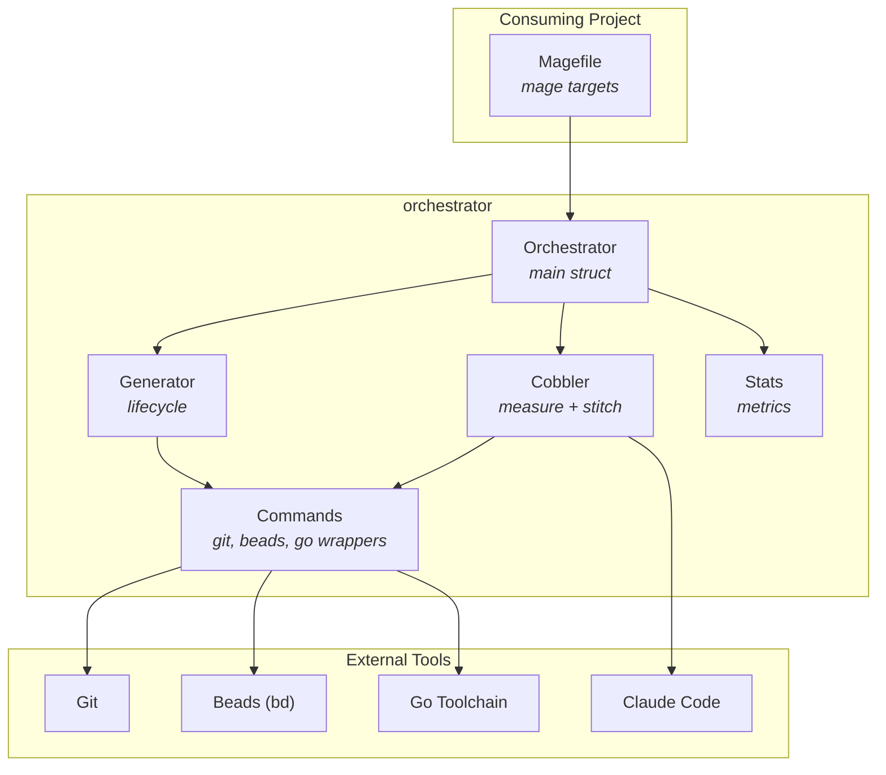

# cobbler-scaffold

Specification constitutions for cobbler-based projects and tooling to validate their correctness; the Mage library implements the measure-stitch workflow to exercise and refine them before the core moves to [cobbler](https://github.com/petar-djukic/cobbler).

Specifications are authored in YAML rather than [spec-kit](https://github.com/github/spec-kit) markdown because Claude reads and generates them autonomously — structured, machine-parseable documents produce more reliable output than prose and are unambiguous in diff.

## Architectural Thesis

AI coding assistants handle individual edits well but break down across sessions that require sequenced tasks, dependency management, and clean commit history. Running Claude directly on a working branch conflates exploration with production commits and leaves recovery from failures to the developer.

The primary contribution of this repository is three YAML constitutions — design, planning, and execution — that govern Claude's behavior in each phase of the cobbler workflow. Constitutions enforce specification-first development: Claude may not write code that does not trace to a PRD, must size tasks within defined LOC bounds, and must close the issue with a traceable commit before ending a session. The analyze command validates that produced specifications are internally consistent — no orphaned PRDs, no missing test-suite linkage, no broken use-case references.

The cobbler workflow that the constitutions govern separates task proposal (measure) from task execution (stitch). Measure invokes Claude with the project's specification tree and produces a dependency-ordered task list. Stitch executes each task in an isolated git worktree, merges the result to the generation branch, and records metrics. The generation branch accumulates only finished work; the loop runs unattended until the backlog is empty or the cycle budget is exhausted.

This repository implements the workflow as a Mage library to accumulate operational experience with the constitutions. Once the design is stable, the orchestration logic moves to [cobbler](https://github.com/petar-djukic/cobbler) and this repository becomes the scaffolding layer that initializes cobbler-based projects with constitutions, configuration, and Mage targets.

## System



*Figure 1 — System context. See [docs/ARCHITECTURE-diagrams.md](docs/ARCHITECTURE-diagrams.md) for additional diagrams.*

## Scope and Status

Release 01.0 (Core Orchestrator and Workflows) is complete: 5 of 5 use cases implemented across 5 PRDs.
Release 02.0 (VS Code Extension) is not started: 5 use cases specified, 0 implemented.

The specification index at [docs/SPECIFICATIONS.yaml](docs/SPECIFICATIONS.yaml) lists every PRD, use case, and test suite with cross-references.

## Workflow

A generation is the primary unit of work. It begins from a tagged main state, creates a timestamped branch, runs measure-stitch cycles, and merges the result back to main with lifecycle tags (`-start`, `-finished`, `-merged`).

```text
generator:start  →  cobbler:measure  →  cobbler:stitch  →  (repeat)  →  generator:stop
```

**Measure** reads `docs/VISION.yaml`, `docs/ARCHITECTURE.yaml`, and the open issue list, then invokes Claude with a prompt template. Claude returns a YAML task list with titles, descriptions, estimated LOC, and dependency indices. The orchestrator imports these into beads with wired dependencies.

**Stitch** picks the next ready task from beads, creates a git worktree on a task branch (`task/{baseBranch}-{issueID}`), invokes Claude with the task description and execution constitution, merges the result, records metrics, and closes the issue. The worktree is deleted after merge. Each task runs in isolation; the generation branch receives only merged output.

**Constitutions** are YAML documents that govern Claude's behavior per phase. The design constitution (`docs/constitutions/design.yaml`) rules specification authoring. The planning constitution controls task sizing, issue structure, and dependency ordering during measure. The execution constitution enforces traceability, Go coding standards, and session-completion discipline during stitch. All three are scaffolded into consuming projects and referenced from `configuration.yaml`.

## Scaffolding a Target Repository

This repository provides the orchestration tooling. To set up orchestration in another Go project, use the scaffold targets from this repo's magefiles.

**Install** the orchestrator into a target repository:

```bash
mage scaffold:push /path/to/target-repo
```

Push copies `orchestrator.go` into the target's `magefiles/orchestrator.go`, writes constitutions to `docs/constitutions/`, prompts to `docs/prompts/`, generates `configuration.yaml` with auto-detected project settings, and wires `magefiles/go.mod` to depend on the published cobbler-scaffold module. The target repository gains all mage targets (build, test, cobbler, generator, scaffold:pop) without any manual setup.

Push also accepts a Go module reference in `module@version` format. The orchestrator downloads the module, copies it to a temp directory, scaffolds it, and prints the path:

```bash
mage scaffold:push github.com/org/repo@v0.20260222.1
```

**Remove** the orchestrator from a target repository:

```bash
mage scaffold:pop /path/to/target-repo
```

Pop removes `magefiles/orchestrator.go`, `docs/constitutions/`, `docs/prompts/`, and `configuration.yaml`. It also drops the orchestrator replace directive from `magefiles/go.mod`. The target's own code and `magefiles/go.mod` are preserved.

Both targets accept `.` for the current directory, but **self-targeting is blocked**: running `scaffold:push .` or `scaffold:pop .` from this repository exits with an error. Push would replace the development magefile with the template; pop would delete source constitutions, prompts, and configuration. Use a separate target repository.

## Reading the Specifications

The specification tree is the source of truth for requirements and design decisions. Code comments and commit messages reference these documents by ID (e.g., `prd001-orchestrator-core R6`).

| Document | Path | Purpose |
| --- | --- | --- |
| Vision | [docs/VISION.yaml](docs/VISION.yaml) | Goals, boundaries, personas, release definitions |
| Architecture | [docs/ARCHITECTURE.yaml](docs/ARCHITECTURE.yaml) | Components, interfaces, protocols, data flows |
| Diagrams | [docs/ARCHITECTURE-diagrams.md](docs/ARCHITECTURE-diagrams.md) | Mermaid companion to ARCHITECTURE.yaml |
| Specifications index | [docs/SPECIFICATIONS.yaml](docs/SPECIFICATIONS.yaml) | PRD, use case, and test suite index with traceability |
| Road map | [docs/road-map.yaml](docs/road-map.yaml) | Releases and the use cases each delivers |
| PRDs | [docs/specs/product-requirements/](docs/specs/product-requirements/) | Per-feature requirements; each requirement carries an R-number |
| Use cases | [docs/specs/use-cases/](docs/specs/use-cases/) | Concrete user flows keyed to a release; named `rel{N}.{M}-uc{NNN}-slug.yaml` |
| Test suites | [docs/specs/test-suites/](docs/specs/test-suites/) | Specified test cases with inputs and expected outputs |
| Constitutions | [docs/constitutions/](docs/constitutions/) | Behavioral rules injected into measure and stitch prompts |

**How to navigate**: Start with [docs/VISION.yaml](docs/VISION.yaml) for context, then [docs/ARCHITECTURE.yaml](docs/ARCHITECTURE.yaml) for component boundaries. When reading code, the file header lists which PRDs it implements. When a requirement is unclear, look up the R-number in the relevant PRD; the use cases for that PRD are listed in [docs/SPECIFICATIONS.yaml](docs/SPECIFICATIONS.yaml).

Use cases are stable by numeric ID. The release they belong to is recorded in [docs/road-map.yaml](docs/road-map.yaml), not in the filename — re-prioritizing a use case to a later release does not rename the file.

## Repository Structure

```text
pkg/orchestrator/      — library implementation; exported types are Orchestrator, Config, New, LoadConfig
orchestrator.go        — Mage target template; scaffold:push copies this to target repos as magefiles/orchestrator.go
magefiles/magefile.go  — build targets for this repository (includes scaffold:push, podman targets)
magefiles/testing.go   — integration test targets (cobbler, generator, resume suites)
docs/                  — VISION, ARCHITECTURE, PRDs, use cases, test suites, constitutions
docs/constitutions/    — design/planning/execution/go-style constitutions (scaffolded into consuming projects)
docs/prompts/          — measure and stitch prompt templates (scaffolded into consuming projects)
tests/e2e/             — end-to-end tests against a scaffolded target repository
configuration.yaml     — orchestrator config (auto-created with defaults if missing)
.claude/               — Claude Code skills and project rules
```

## Technology Choices

**Go** — the library embeds prompt templates and constitutions as `embed.FS` assets, which requires a compiled language; Go's `os/exec` wrappers around git, beads, and podman are straightforward and testable.

**Mage** — consuming projects already use Mage for their own build logic; exposing orchestrator operations as Mage targets avoids introducing a second build system.

**Beads (bd)** — git-backed, JSONL issue tracker that commits state changes to the repository. This makes the issue list part of the generation branch's history and recoverable after any interruption without a running service.

**Podman** — rootless container runtime. Claude runs inside a container to prevent it from modifying host files outside the mounted working directory. The container also provides a reproducible environment for credential injection.

## Build and Test

```bash
# Unit tests (pkg/orchestrator)
mage test:unit

# E2E tests — scaffolds a target repo and runs non-Claude tests
mage test:integration

# Full E2E suite including Claude-gated tests (requires podman image and credentials)
mage credentials        # extract Claude credentials from macOS Keychain
mage test:generatorE2E  # runs full E2E suite including Claude

# Scaffold a target repo for manual testing
mage scaffold:push /path/to/target

# Build, lint, install
mage build
mage lint
mage install
```

E2E tests download `github.com/petar-djukic/go-unix-utils`, scaffold it once in `TestMain`, and copy the snapshot per test. The scaffold round-trip test (`TestScaffold_PushPopRoundTrip`) creates an empty repository, scaffolds it, verifies all files, pops the scaffold, and verifies removal.

## License

MIT
