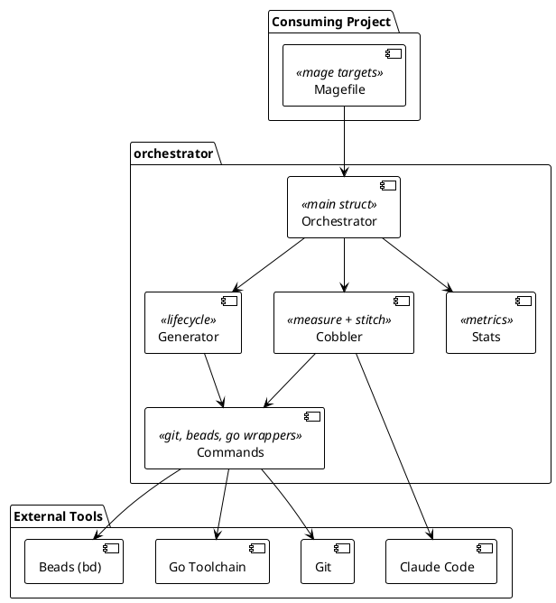

# mage-claude-orchestrator

Go library that runs sustained, multi-task Claude Code sessions through a measure-propose / stitch-execute loop, integrating with a consuming project's Magefile build system.

## Architectural Thesis

AI coding assistants handle individual edits well but break down across sessions that require sequenced tasks, dependency management, and clean commit history. Running Claude directly on a working branch conflates exploration with production commits and leaves recovery from failures to the developer.

This library solves the problem by separating task proposal (measure) from task execution (stitch). Measure invokes Claude with the project's specification tree and produces a dependency-ordered task list in the issue tracker. Stitch executes each task in an isolated git worktree, merges the result to the generation branch, and records metrics. The generation branch accumulates only finished work; the loop runs unattended until the backlog is empty or the cycle budget is exhausted.

The design contract for Claude's behavior in each phase is expressed as constitutions — YAML documents injected into the measure and stitch prompts. Constitutions enforce specification-first development: Claude may not write code that does not trace to a PRD, and must close the issue with a traceable commit before ending a task session.

## System



*Figure 1 — System context. See [docs/ARCHITECTURE-diagrams.md](docs/ARCHITECTURE-diagrams.md) for additional diagrams.*

## Scope and Status

Release 01.0 (Core Orchestrator and Workflows) is complete: 5 of 5 use cases implemented across 5 PRDs.
Release 02.0 (VS Code Extension) is not started: 5 use cases specified, 0 implemented.

The specification index at [docs/SPECIFICATIONS.yaml](docs/SPECIFICATIONS.yaml) lists every PRD, use case, and test suite with cross-references.

## Workflow

A generation is the primary unit of work. It begins from a tagged main state, creates a timestamped branch, runs measure-stitch cycles, and merges the result back to main with lifecycle tags (`-start`, `-finished`, `-merged`).

```text
generator:start  →  cobbler:measure  →  cobbler:stitch  →  (repeat)  →  generator:stop
```

**Measure** reads `docs/VISION.yaml`, `docs/ARCHITECTURE.yaml`, and the open issue list, then invokes Claude with a prompt template. Claude returns a YAML task list with titles, descriptions, estimated LOC, and dependency indices. The orchestrator imports these into beads with wired dependencies.

**Stitch** picks the next ready task from beads, creates a git worktree on a task branch (`task/{baseBranch}-{issueID}`), invokes Claude with the task description and execution constitution, merges the result, records metrics, and closes the issue. The worktree is deleted after merge. Each task runs in isolation; the generation branch receives only merged output.

**Constitutions** are YAML documents that govern Claude's behavior per phase. The design constitution (`docs/constitutions/design.yaml`) rules specification authoring. The planning constitution controls task sizing, issue structure, and dependency ordering during measure. The execution constitution enforces traceability, Go coding standards, and session-completion discipline during stitch. All three are scaffolded into consuming projects and referenced from `configuration.yaml`.

## Reading the Specifications

The specification tree is the source of truth for requirements and design decisions. Code comments and commit messages reference these documents by ID (e.g., `prd001-orchestrator-core R6`).

| Document | Path | Purpose |
| --- | --- | --- |
| Vision | [docs/VISION.yaml](docs/VISION.yaml) | Goals, boundaries, personas, release definitions |
| Architecture | [docs/ARCHITECTURE.yaml](docs/ARCHITECTURE.yaml) | Components, interfaces, protocols, data flows |
| Diagrams | [docs/ARCHITECTURE-diagrams.md](docs/ARCHITECTURE-diagrams.md) | PlantUML companion to ARCHITECTURE.yaml |
| Specifications index | [docs/SPECIFICATIONS.yaml](docs/SPECIFICATIONS.yaml) | PRD, use case, and test suite index with traceability |
| Road map | [docs/road-map.yaml](docs/road-map.yaml) | Releases and the use cases each delivers |
| PRDs | [docs/specs/product-requirements/](docs/specs/product-requirements/) | Per-feature requirements; each requirement carries an R-number |
| Use cases | [docs/specs/use-cases/](docs/specs/use-cases/) | Concrete user flows keyed to a release; named `rel{N}.{M}-uc{NNN}-slug.yaml` |
| Test suites | [docs/specs/test-suites/](docs/specs/test-suites/) | Specified test cases with inputs and expected outputs |
| Constitutions | [docs/constitutions/](docs/constitutions/) | Behavioral rules injected into measure and stitch prompts |

**How to navigate**: Start with [docs/VISION.yaml](docs/VISION.yaml) for context, then [docs/ARCHITECTURE.yaml](docs/ARCHITECTURE.yaml) for component boundaries. When reading code, the file header lists which PRDs it implements. When a requirement is unclear, look up the R-number in the relevant PRD; the use cases for that PRD are listed in [docs/SPECIFICATIONS.yaml](docs/SPECIFICATIONS.yaml).

Use cases are stable by numeric ID. The release they belong to is recorded in [docs/road-map.yaml](docs/road-map.yaml), not in the filename — re-prioritizing a use case to a later release does not rename the file.

## Repository Structure

```text
pkg/orchestrator/      — library implementation; exported types are Orchestrator, Config, New, LoadConfig
orchestrator.go        — Mage target bindings; copied verbatim into consuming projects as magefiles/orchestrator.go
docs/                  — VISION, ARCHITECTURE, PRDs, use cases, test suites, constitutions
docs/constitutions/    — design/planning/execution constitutions (scaffolded into consuming projects)
tests/e2e/             — end-to-end tests against a real target repository (github.com/petar-djukic/mcp-calc)
magefiles/             — build tooling for this repository; separate Go module
.claude/               — Claude Code skills and project rules
```

## Technology Choices

**Go** — the library embeds prompt templates and constitutions as `embed.FS` assets, which requires a compiled language; Go's `os/exec` wrappers around git, beads, and podman are straightforward and testable.

**Mage** — consuming projects already use Mage for their own build logic; exposing orchestrator operations as Mage targets avoids introducing a second build system.

**Beads (bd)** — git-backed, JSONL issue tracker that commits state changes to the repository. This makes the issue list part of the generation branch's history and recoverable after any interruption without a running service.

**Podman** — rootless container runtime. Claude runs inside a container to prevent it from modifying host files outside the mounted working directory. The container also provides a reproducible environment for credential injection.

## Build and Test

```bash
# Build the library and run unit tests
mage test:unit

# Scaffold a target repository and run non-Claude E2E tests
mage test:integration

# Full E2E suite including Claude-gated tests (requires podman image and credentials)
mage credentials   # extract Claude credentials from macOS Keychain
mage test:e2e      # sets E2E_CLAUDE=1 automatically

# Build, lint, install
mage build
mage lint
mage install
```

E2E tests run against `github.com/petar-djukic/mcp-calc`. The `TestMain` function downloads and scaffolds the repository once; individual tests copy the snapshot. Claude-gated tests skip unless `E2E_CLAUDE=1` is set.

## License

MIT
