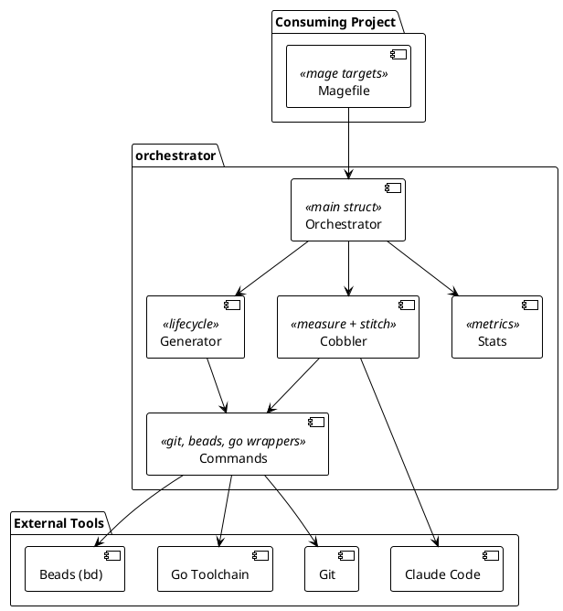

# Mage Claude Orchestrator Architecture

## System Overview

Mage Claude Orchestrator is a Go library that automates AI-driven code generation through a two-phase loop: measure (propose tasks) and stitch (execute tasks in isolated worktrees). Consuming projects import the library, configure it with project-specific paths and templates, and expose its methods as Mage targets.

The system operates as build tooling, not a standalone application. An `Orchestrator` struct holds a `Config` and provides methods that Mage calls as targets. These methods coordinate four subsystems: git branch management, Claude invocation (containerized via podman), issue tracking (beads), and metrics collection.

|  |
|:--:|



|Figure 1 System context showing orchestrator components and external tools |

### Generation Lifecycle

Generations are the primary unit of work. A generation starts from a tagged main state, creates a branch, runs measure-stitch cycles, and merges the result back to main.

States: `created` (branch exists, sources reset) -> `running` (cycles in progress) -> `finished` (tagged, ready to merge) -> `merged` (on main, branch deleted). An alternative terminal state is `abandoned` (generation was never merged).

The generation branch name follows the pattern `{GenPrefix}{timestamp}`, where the timestamp is formatted as `2006-01-02-15-04-05`. Tags mark lifecycle events: `{branch}-start`, `{branch}-finished`, `{branch}-merged`, `{branch}-abandoned`.

### Cobbler Workflow

The cobbler workflow has two phases that run in sequence within each cycle.

**Measure** reads the project state (documentation, existing issues) and invokes Claude with a prompt template. Claude proposes tasks as a JSON array. We import these tasks into beads with dependency wiring.

**Stitch** picks ready tasks from beads one at a time. For each task: create a git worktree on a task branch, invoke Claude with the task description, merge the task branch back, record metrics, close the task. Task branches use the pattern `task/{baseBranch}-{issueID}`.

### Task Isolation

Each stitch task runs in a separate git worktree. This prevents concurrent tasks from interfering with each other and keeps the generation branch clean. The worktree lives in a temp directory (`$TMPDIR/{repoName}-worktrees/{issueID}`). After Claude completes, we merge the task branch into the generation branch and remove the worktree.

Recovery handles interrupted runs. On resume, we scan for stale task branches (worktrees that were not cleaned up), remove them, reset their issues to ready, and continue.

## Main Interface

### Orchestrator and Config

The Orchestrator is the entry point. Consuming projects place a `configuration.yaml` at the repository root and call `NewFromFile()`, or construct a Config in Go code and pass it to `New()`.

```go
type Orchestrator struct {
    cfg Config
}

func New(cfg Config) *Orchestrator
func NewFromFile(path string) (*Orchestrator, error)
```

Config holds all orchestrator settings. The YAML file is the sole source of truth for all options, making every generation reproducible. The orchestrator applies defaults to zero-value fields.

Table 1 Config Fields

| Field | Type | YAML Key | Default | Purpose |
|-------|------|----------|---------|---------|
| ModulePath | string | module_path | (required) | Go module path |
| BinaryName | string | binary_name | (required) | Compiled binary name |
| BinaryDir | string | binary_dir | "bin" | Output directory for binaries |
| MainPackage | string | main_package | | Path to main.go entry point |
| GoSourceDirs | []string | go_source_dirs | | Directories containing Go source |
| VersionFile | string | version_file | | Path to version.go |
| GenPrefix | string | gen_prefix | "generation-" | Prefix for generation branches |
| BeadsDir | string | beads_dir | ".beads/" | Beads database directory |
| CobblerDir | string | cobbler_dir | ".cobbler/" | Scratch directory |
| MagefilesDir | string | magefiles_dir | "magefiles" | Directory skipped when deleting Go files |
| SecretsDir | string | secrets_dir | ".secrets" | Directory for token files |
| DefaultTokenFile | string | default_token_file | "claude.json" | Credential filename |
| SpecGlobs | map[string]string | spec_globs | | Glob patterns for word-count stats |
| SeedFiles | map[string]string | seed_files | | Template file paths seeded during reset |
| MeasurePrompt | string | measure_prompt | (embedded) | File path to custom measure prompt template |
| StitchPrompt | string | stitch_prompt | (embedded) | File path to custom stitch prompt template |
| ClaudeArgs | []string | claude_args | (standard flags) | CLI arguments for Claude execution |
| SilenceAgent | *bool | silence_agent | true | Suppress Claude stdout |
| MaxIssues | int | max_issues | 10 | Maximum tasks per measure or stitch phase |
| Cycles | int | cycles | 0 | Safety limit for cycles (0 = run until all issues closed) |
| UserPrompt | string | user_prompt | "" | Additional context for the measure prompt |
| GenerationBranch | string | generation_branch | "" | Explicit branch to work on (auto-detect if empty) |
| TokenFile | string | token_file | DefaultTokenFile | Credential file override in SecretsDir |
| EstimatedLinesMin | int | estimated_lines_min | 250 | Minimum estimated lines per task |
| EstimatedLinesMax | int | estimated_lines_max | 350 | Maximum estimated lines per task |
| CleanupDirs | []string | cleanup_dirs | [] | Directories to remove after generation stop or reset |
| PodmanImage | string | podman_image | (required) | Container image for Claude execution |
| PodmanArgs | []string | podman_args | [] | Additional arguments passed to podman run |
| ClaudeMaxTimeSec | int | claude_max_time_sec | 300 | Maximum seconds per Claude invocation; process killed on expiry |

`LoadConfig(path)` reads the YAML file, resolves SeedFiles values (file paths to template content), resolves MeasurePrompt/StitchPrompt (file paths to template content), and applies defaults. SilenceAgent uses a `*bool` to distinguish "not set in YAML" (nil, defaults to true) from "explicitly set to false".

### Operations

Table 2 Orchestrator Operations

| Method | Purpose | PRD |
|--------|---------|-----|
| GeneratorStart() | Tag main, create generation branch, reset sources | prd002 |
| GeneratorRun() | Run measure+stitch cycles until all issues are closed | prd002 |
| GeneratorResume() | Recover and continue interrupted run | prd002 |
| GeneratorStop() | Merge generation into main, tag, clean up | prd002 |
| GeneratorReset() | Destroy all generations, return to clean main | prd002 |
| GeneratorList() | Show active and past generations | prd002 |
| GeneratorSwitch() | Switch between generation branches | prd002 |
| Measure() | Propose tasks via Claude | prd003 |
| Stitch() | Execute ready tasks in worktrees | prd003 |
| Stats() | Print LOC and documentation metrics | prd005 |
| Init() | Initialize beads | prd001 |
| FullReset() | Reset cobbler, generator, and beads | prd001 |
| CobblerReset() | Remove scratch directory | prd003 |
| BeadsInit() | Initialize beads database | prd001 |
| BeadsReset() | Reset beads database | prd001 |

### Prompt Templates

Prompts are Go text/template strings embedded from `prompts/measure.tmpl` and `prompts/stitch.tmpl`. Consuming projects can override them via Config.MeasurePrompt and Config.StitchPrompt.

Table 3 Template Data Types

| Template | Data Type | Fields |
|----------|-----------|--------|
| Measure | MeasurePromptData | ExistingIssues (JSON string), Limit (int), OutputPath (string), UserInput (string), LinesMin (int), LinesMax (int) |
| Stitch | StitchPromptData | Title, ID, IssueType, Description (all strings) |

### Metrics

Every Claude invocation records an InvocationRecord as a JSON comment on the beads issue.

Table 4 InvocationRecord Fields

| Field | Type | Purpose |
|-------|------|---------|
| Caller | string | "measure" or "stitch" |
| StartedAt | string (RFC3339) | When Claude was invoked |
| DurationS | int | Total duration in seconds |
| Tokens | {Input, Output int} | Token usage |
| LOCBefore | {Production, Test int} | Go LOC before Claude |
| LOCAfter | {Production, Test int} | Go LOC after Claude |
| Diff | {Files, Insertions, Deletions int} | Git diff stats |

## System Components

**Orchestrator (orchestrator.go)**: Entry point. Holds Config, provides New() constructor, manages logging with optional generation tagging. All other components are methods on this struct or package-level functions.

**Generator (generator.go)**: Manages the generation lifecycle. Creates generation branches, runs cycles, merges results to main, handles resume from interrupted runs. Uses git tags to mark lifecycle events. Resets Go sources and re-seeds template files on start and reset.

**Cobbler - Measure (measure.go)**: Builds the measure prompt from existing issues and project state, invokes Claude, parses the JSON output, and imports proposed issues into beads with dependency wiring. Records invocation metrics.

**Cobbler - Stitch (stitch.go)**: Picks ready tasks from beads, creates worktrees, invokes Claude, merges branches, records metrics, and closes tasks. Handles recovery of stale tasks from interrupted runs.

**Cobbler Common (cobbler.go)**: Claude invocation (runClaude), token parsing, LOC capture, invocation recording, configuration logging, and worktree path management.

**Commands (commands.go)**: Wrapper functions for external tools. Over 50 functions wrapping git, beads (bd), and Go CLI commands. Centralizes binary names as constants and provides structured access to command output.

**Stats (stats.go)**: Collects Go LOC counts (production and test) and documentation word counts. Uses the configured GoSourceDirs and SpecGlobs. Output is used for invocation records and the `mage stats` target.

**Beads (beads.go)**: Initializes and resets the beads issue tracker. Manages the beads database directory and provides helpers for beads lifecycle operations.

**Config (config.go)**: Config struct with YAML tags, LoadConfig() for reading configuration.yaml, SeedData template data, Silence() and EffectiveTokenFile() helpers, and applyDefaults() for zero-value fields.

## Design Decisions

**Decision 1: Library with YAML configuration.** We chose to build a library that consuming projects import, configured via a `configuration.yaml` file at the repository root. This makes every generation reproducible: the YAML file records exactly what options were used. Consuming projects call `NewFromFile("configuration.yaml")` or construct a Config in Go and pass it to `New()`. The Mage build system provides the CLI interface. Alternative: a standalone CLI would duplicate configuration concerns; CLI flags would lose reproducibility since flag values are not recorded.

**Decision 2: Git worktree isolation.** Each stitch task runs in a separate git worktree on its own branch. This prevents concurrent tasks from interfering and keeps the generation branch clean. Worktrees are temporary and cleaned up after merge. Alternative: running Claude directly on the generation branch risks partial commits and merge conflicts between tasks.

**Decision 3: Two-phase cobbler loop.** We separate task proposal (measure) from task execution (stitch). This allows measure to see the full project state before proposing work, and stitch to execute tasks independently. Alternative: a single-phase approach where Claude both proposes and executes loses the ability to review proposed tasks before execution.

**Decision 4: Container-isolated Claude execution.** We run Claude inside a podman container. The orchestrator wraps every invocation with `podman run`, mounting the working directory at the same path inside the container so absolute paths in prompts resolve correctly. A pre-flight check verifies that podman is installed, the configured image is available, and containers can start before any workflow begins. This isolates Claude from the host environment and makes builds reproducible across machines. Alternative: running Claude as a bare binary on the host is simpler but provides no isolation and makes environment differences harder to debug.

**Decision 5: Beads for issue tracking.** We use the beads git-backed issue tracker because it stores issues as JSONL files tracked by git. This means task state travels with the generation branch and is recoverable from any commit. Alternative: external issue trackers (GitHub Issues, Jira) require network access and do not travel with the branch.

**Decision 6: Embedded prompt templates with override.** Default prompts are embedded in the binary via `//go:embed`. Consuming projects can override them through Config.MeasurePrompt and Config.StitchPrompt. This gives zero-configuration defaults with full customizability. Alternative: external prompt files require file path management and increase deployment complexity.

**Decision 7: Recovery on resume.** Generator resume scans for stale task branches, orphaned in-progress issues, and leftover worktrees. It cleans all of them up and resets affected tasks to ready before continuing. This makes interrupted runs recoverable without manual intervention. Alternative: requiring manual cleanup after interruption is error-prone and frustrating.

## Technology Choices

Table 5 Technology Choices

| Component | Technology | Purpose |
|-----------|------------|---------|
| Language | Go 1.25 | Library and consuming projects use Go |
| Build system | Magefile (magefile/mage) | Orchestrator methods exposed as Mage targets |
| Version control | git (worktrees, tags, branches) | Isolation, lifecycle tracking, merge |
| Issue tracking | Beads (bd CLI) | Git-backed task management via JSONL |
| AI execution | Claude Code (CLI) | Code generation and task execution |
| Container runtime | Podman | Isolates Claude execution in containers |
| Prompt templating | Go text/template | Parameterized prompts |
| YAML parsing | gopkg.in/yaml.v3 | Configuration file parsing |

## Project Structure

```
mage-claude-orchestrator/
  orchestrator.go     # Orchestrator struct, New(), NewFromFile(), logging
  config.go           # Config struct, LoadConfig(), YAML parsing, defaults
  cobbler.go          # runClaude, token parsing, LOC capture, metrics
  measure.go          # Measure phase: prompt, Claude, import
  stitch.go           # Stitch phase: worktree, Claude, merge
  generator.go        # Generation lifecycle: start/run/resume/stop/reset
  commands.go         # Git, beads, Go command wrappers
  beads.go            # Beads initialization and reset
  stats.go            # LOC and documentation metrics
  go.mod              # Module definition (gopkg.in/yaml.v3)
  prompts/
    measure.tmpl      # Default measure prompt template
    stitch.tmpl       # Default stitch prompt template
```

All code lives in a single `orchestrator` package. Consuming projects import it and wire it into their magefiles.

## Implementation Status

The orchestrator is implemented and in active use by the Crumbs project. All components described in this architecture are functional: generation lifecycle, measure and stitch workflows, metrics collection, and recovery from interrupted runs.

## Related Documents

Table 6 Related Documents

| Document | Purpose |
|----------|---------|
| VISION.md | What we build and why; success criteria and boundaries |
| road-map.yaml | Release schedule and use case status |
| prd001-orchestrator-core | Config, Orchestrator struct, YAML loading, initialization |
| prd002-generation-lifecycle | Generation start, run, resume, stop, reset, list, switch |
| prd003-cobbler-workflows | Measure and stitch phases, prompt templates, task execution |
| prd005-metrics-collection | Stats, invocation records, LOC snapshots |
| engineering/eng01-generation-workflow | Generation conventions and task branch naming |
| engineering/eng02-prompt-templates | Prompt template conventions and customization |
